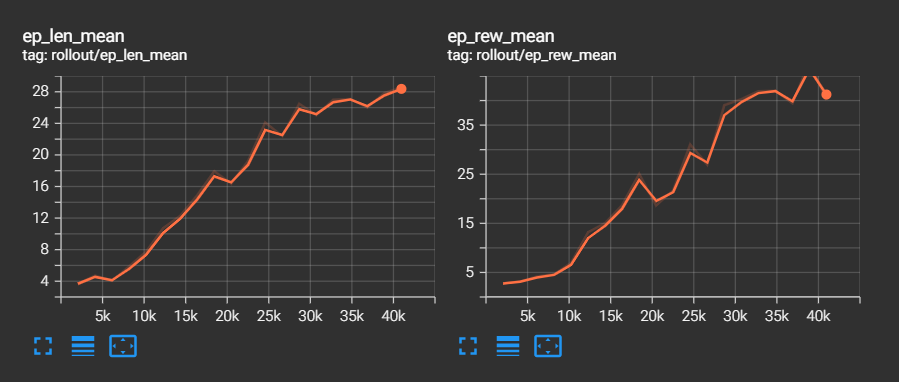

# Snake Game Reinforcement Learning 

В данном проекте RL алгоритм PPO учится играть в Змейку
Сниппеты кода игры взяты из: https://github.com/TheAILearner/Snake-Game-using-OpenCV-Python/blob/master/snake_game_using_opencv.ipynb 

### Описание проекта:
- `main.py` - основной код с обучением
- `snake_env.py` - окружение с игрой
- `run_model.py` - подгрузка обученной модели и демо запуск игры

### Промежуточные результаты обучения

